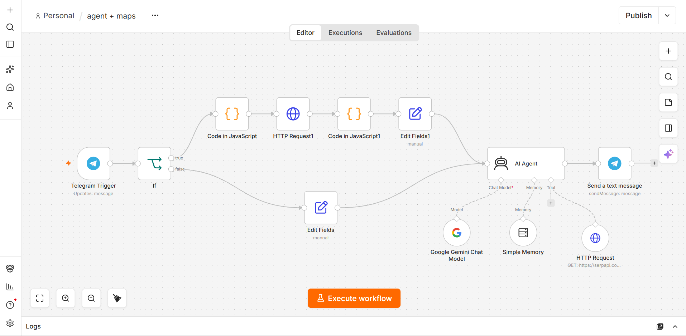
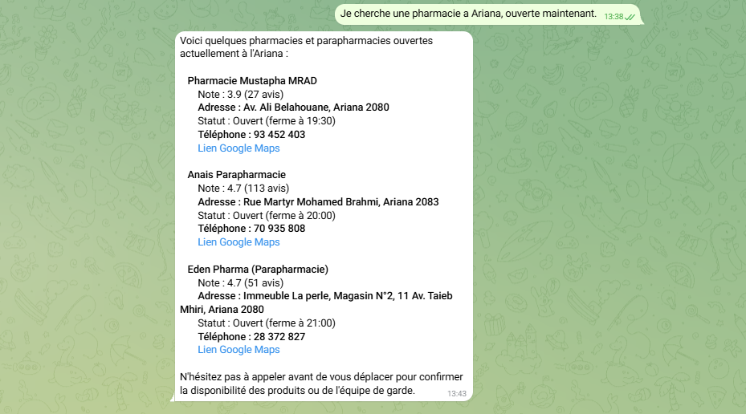

# AI-Powered Maps Assistant

An AI-powered search assistant built with **n8n, Google Gemini, SerpApi, and Telegram**.

It helps users find restaurants, cafés, shops, hotels, and other businesses in Tunisia using natural language.

## ✨ Features

* 🤖 AI-powered business search
* 📍 Text-based location search
* 🗺️ Google Maps URL → coordinates extraction
* 🇹🇳 Tunisia-focused results
* 🌍 English, French, Arabic & Tunisian Arabic
* 🚶 Walking-oriented searches
* 💬 Telegram interface
* 🧠 Conversation memory

## 🏗️ Workflow



## 💬 Telegram Example



## 🛠️ Built With

* **n8n** — workflow automation
* **Google Gemini** — AI agent
* **SerpApi** — search data
* **Telegram** — user interface
* **JavaScript** — coordinate extraction

## ⚙️ Setup

1. Import the workflow into n8n.
2. Add your own Telegram credentials.
3. Add your Google Gemini API key.
4. Add your SerpApi API key.
5. Activate the workflow.

## 📂 Structure

```text
n8n-ai-maps-agent/
├── README.md
├── workflow/
│   └── maps-agent.json
└── images/
    ├── maps-agent.png
    └── telegram-result.png
